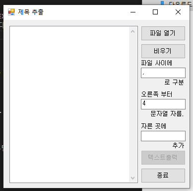
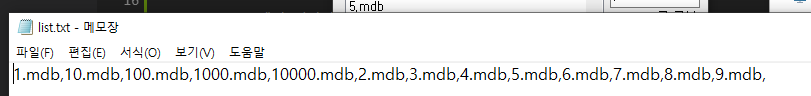
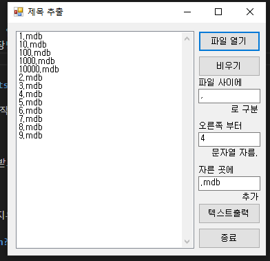
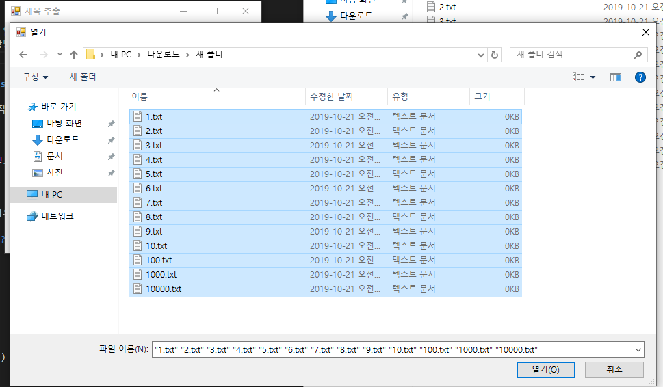

# Extract-Title

파일이름들을 text파일로 만들어줍니다.

## Download

- [Windows x86 zip file](./build/제목&#32;추출&#32;x86&#32;0.0.1.zip?raw=true)

## Info

- 파일 리스트를 가져와 일괄적으로 이름들을 TEXT파일로 만들어줍니다. 
  
  

- 특정 조건을 걸어 확장명을 지울 수도 있습니다.
  
  
  
- 한번에 여러 파일을 불러올 수 있습니다.
  
  

## System Requirements

- Windows 10에서 정상작동하는 것을 확인하였습니다.

## How to Install

- zip파일을 다운로드 받고 압축을 해제 합니다.

## How to Delete

- 압축 해제한 폴더를 지우거나 프로그램을 지우면 됩니다.

## What did you learn?

- VB.NET을 배울 수 있었습니다.
- I/O를 배울 수 있었습니다. 
- LEFT/RIGHT를 배울 수 있었습니다.

## Finally

- System Remedy 프로젝트의 DB 생성을 빠르게 하기 위해 개발되었습니다.
- 간단 기능 구현을 목표로 하였기 때문에 변수명, 폼명이 기본 셋팅과 동일합니다.
- 제목 수정 프로젝트와 합칠 계획입니다.

## Modify Content

- 2013.08.17 ( 0.0.1 )
  - 기능 구현

## Copyright

- 비상업적 용도로 사용 가능하며 링크를 반드시 포함해주세요.
- 문제가 되는 내용이 있다면 언제든지 [`issue`](https://github.com/Sotaneum/Extract-Title/issues/new), [`Pull requests`](https://github.com/Sotaneum/Extract-Title/compare) 부탁드립니다.
